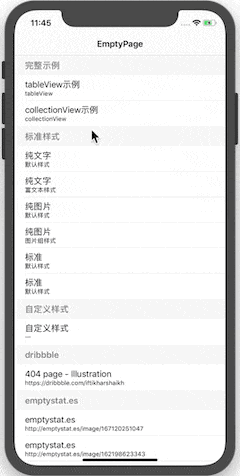
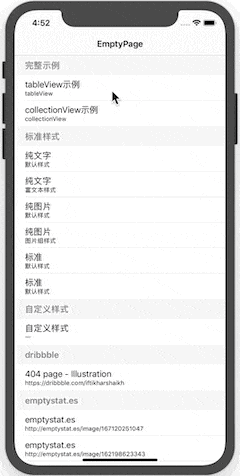
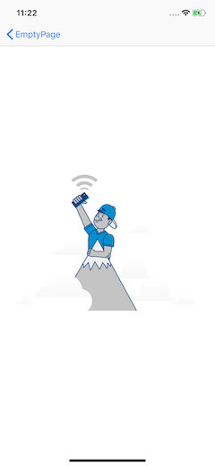
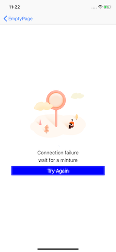

[](https://travis-ci.org/BLFoundation/EmptyPage)


# EmptyPage

一个UITableView / UICollectionView扩展，用于在视图没有内容显示的时候显示空白页.

### Features

- [x] 支持UICollectionView & UITableView
- [x] 支持链式配置预置模板视图
- [ ] 支持更多实用与设计感的模板

   

### 预置模板视图(纯文字/纯图片/标准)


## Requirements

- Swift 4
- iOS 8+
- Xcode 10+

## 安装

- 使用cocoapods安装

```ruby
# 如果采用自定义样式,只需要引入 Core
pod 'EmptyPage/Core'
# 如果预设样式能够满足需求, 可以使用一下形式引入
pod 'EmptyPage'
pod 'EmptyPage/Standard'
```

## 使用

### 简单用法

##### In Swift:

- 配置空白页

  ```swift
  let emptyView = EmptyPageView.ContentView.standard
  	.change(hspace: .button, value: 80)
  	.change(height: .button, value: 60)
  	.change(hspace: .image, value: 15)
  	.config(button: { (item) in
  		item.backgroundColor = UIColor.blue
  		item.contentEdgeInsets = UIEdgeInsets(top: 8, left: 20, bottom: 8, right: 20)
  	})
  	.set(image: UIImage(named: "empty-1002")!)
  	.set(title: "Connection failure", color: UIColor.black, font: UIFont.boldSystemFont(ofSize: 24))
  	.set(text: "Something has gone wrong with the internet connection. Let's give it another shot.", color: UIColor.black, font: UIFont.systemFont(ofSize: 15))
  	.set(buttonTitle: "TRY AGAIN")
  	.set(tap: {
  	// 点击事件
  	})
  	.mix()
  ```

- 设置空白页

  ```swift
  tableView.setEmpty(view: emptyView)
  collectionView.setEmpty(view: emptyView)
  ```


## Author

linhay: is.linhay@outlook.com

## License

EmptyPage is available under the Apache License. See the LICENSE file for more info.
