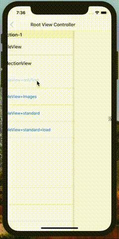

# EmptyPage


[](https://travis-ci.org/158179948@qq.com/EmptyPage) 
[](http://cocoapods.org/pods/EmptyPage)
[](http://cocoapods.org/pods/EmptyPage)
[](http://cocoapods.org/pods/EmptyPage)

## 示例:

   


## Features

- [x] 支持UICollectionView & UITableView
- [ ] 支持WKWebview & UIWebview
- [ ] 支持UIScrollView
- [ ] 支持更多实用与设计感的样式

## 安装

- 使用cocoapods安装

```ruby
# 如果采用自定义样式,只需要引入 Core
pod 'EmptyPage/Core'
# 如果预设样式能够满足需求, 可以使用一下形式引入
pod 'EmptyPage'
pod 'EmptyPage/Resources'
```

## 使用

- 由于swift 4.0 取消了 `'initialize' ` 函数,所以需要在合适的时机执行以下函数才可以正常工作:


```swift
EmptyPage.begin()
```

- 只引入 `'EmptyPage/Core'`:

```swift
let emptyView = EmptyView() // 自定义空白页
collectionView.emptyView = emptyView // 设置
collectionView.reloadData()	// 生效

tableView.emptyView = emptyView	//设置
tableView.reloadData() // 生效
```

- 引入`pod 'EmptyPage'`或者 `pod 'EmptyPage/Resources'`:

```swift
// 🌰:
// 纯文字
let emptyView: EmptyPageView = .onlyText(text: "没有更多信息")
let emptyView: EmptyPageView = .onlyText(attributed: NSAttributedString(string: "没有更多信息"))

// 纯图片(支持单张与多张)
let emptyView: EmptyPageView = .onlyImages(images: [UIImage])
                   
// 图片(支持单张与多张) + 标题 + 描述 + 一个按钮 的样式
let emptyView: EmptyPageView = .standard(images: [UIImage(named: "empty")!],
					title: "标题",
					text: "描述文本",
					btnTitle: "按钮标题") {
					print("按钮事件")
	}

// 设置
tableView.setEmpty(view: emptyView)
```

## Author

linhey:  linhan.linhey@outlook.com

## License

EmptyPage is available under the Apache License. See the LICENSE file for more info.
