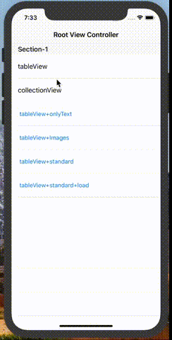
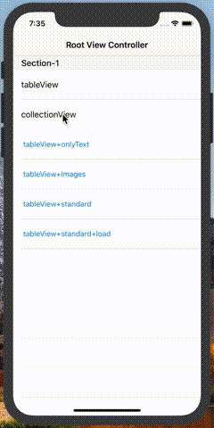
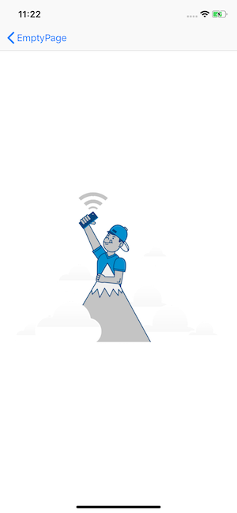
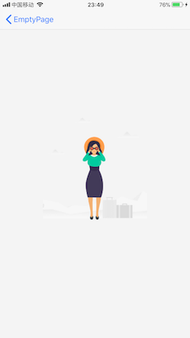
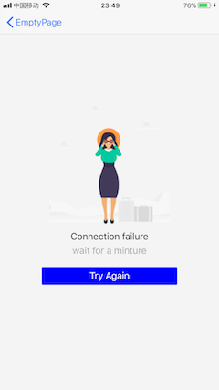

[](http://cocoapods.org/pods/EmptyPage)
[](http://cocoapods.org/pods/EmptyPage)

# EmptyPage

iOS 快速集成空白页视图.

###Features

- [x] 支持UICollectionView & UITableView

- [ ] 支持WKWebview & UIWebview

- [ ] 支持UIScrollView

- [ ] 支持更多实用与设计感的样式

      ​

   

### 默认样式(纯文字/纯图片/标准)


## Requirements

- Swift 4
- iOS 8+

## 安装

- 使用cocoapods安装

```ruby
# 如果采用自定义样式,只需要引入 Core
pod 'EmptyPage/Core'
# 如果预设样式能够满足需求, 可以使用一下形式引入
pod 'EmptyPage'
pod 'EmptyPage/Standard'
# 后期加入的通用样式将以扩展的形式加入到以下仓库中
pod 'EmptyPage/Spec'
```

## 使用

- 由于swift 4.0 取消了 `'initialize' ` 函数,所以需要在合适的时机执行以下函数才可以正常工作:


```swift
EmptyPage.begin()
```

- 只引入 `'EmptyPage/Core'`:

  适合构建有丰富特性的自定义样式.

```swift
// 需要自定义空白页样式
let emptyView = EmptyView()
// 直接给emptyView属性赋值,会在reloadData的时候判断是否需要显示
collectionView.emptyView = emptyView
// 调用reloadData才会判断是否需要显示
collectionView.reloadData()
```

-  引入 `pod 'EmptyPage/Standard'`:

  默认提供了3套默认样式,纯文本样式/纯图片样式/标准样式(图片+标题+描述+按钮形式)

   - 并提供了丰富的设置函数.


  - 并且大部分属性都是能直接访问修改.方便个人定制.
  - 使用EmptyPageView接口实现:

  ```swift
  // 图片(支持单张与多张) + 标题 + 描述 + 一个按钮 的样式
  let emptyView: EmptyPageView = .standard(images: [UIImage(named: "empty")!],
  					title: "标题",
  					text: "描述文本",
  					btnTitle: "按钮标题") {
  					print("按钮事件")
  	}
  	
  // 设置
  tableView.setEmpty(view: emptyView) // 等价于 tableView.emptyView = emptyView
  ```

  - 自定义默认样式

  ```swift
  // 获取标准样式
  let view = EmptyPageView.ContentView.standard
  // 自定义配置标准样式
  view.configImageView(images: [UIImage(named: "empty-1002")!])
  view.titleLabel.text = "Connection failure"
  view.button.setTitle("TRY AGAIN", for: .normal)
  // 将标准样式条添加至背景View上(提供了约束设置的功能)
  let emptyView: EmptyPageView = .mix(view: view)
  // 设置
  tableView.setEmpty(view: emptyView) // 等价于 tableView.emptyView = emptyView
  ```


- 引入`pod 'EmptyPage'`或者 `pod 'EmptyPage/Spec'`:

  **目前是空的**,会在后期加入一些更加通用的样式,提高开发效率😁.

## Author

linhey:  linhan.linhey@outlook.com

## License

EmptyPage is available under the Apache License. See the LICENSE file for more info.
